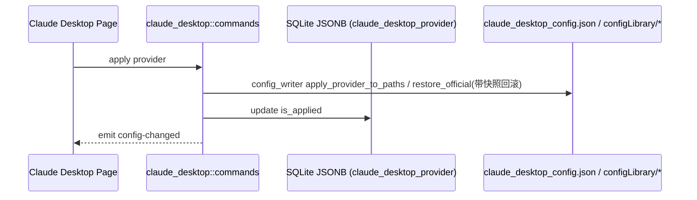

# Claude Desktop 后端模块说明

## 一句话职责

- `claude_desktop/` 负责 Claude Desktop 的 3P（third-party）网关 profile 写入:解析平台路径、按 cc-switch 3P profile 方案写 `claude_desktop_config.json`、`configLibrary/<PROFILE_ID>.json` 与 `configLibrary/_meta.json`,以及 provider / common config 的 SQLite 存储。

## Source of Truth

- Claude Desktop 是"配置文件路径模块",不是"根目录模块":它不改任何 CLI 根目录,只改平台固定路径下的几个 JSON 文件。
- 路径决议只依赖平台 + 环境变量(`LOCALAPPDATA` / `HOME`),不读取 DB、环境变量或 shell 配置推导根目录。
- Provider 与 common config 的主存储是 SQLite JSONB(表 `claude_desktop_provider`);磁盘文件是运行时事实,apply 时才改写。
- 生效状态判定只读 `_meta.json` 的 `appliedId` 与 `configLibrary/<PROFILE_ID>.json` 的 `inferenceGatewayBaseUrl` / `inferenceModels`,不读 `deploymentMode`。

## 路径事实(平台矩阵)

| 平台 | normal 数据目录 | threep 数据目录 | 说明 |
|------|-----------------|-----------------|------|
| Windows | `%LOCALAPPDATA%\Claude` | `%LOCALAPPDATA%\Claude-3p` | 二者缺失时回退 `~\AppData\Local`;兼容版本号目录 `Claude-3p-*` |
| macOS | `~/Library/Application Support/Claude` | `~/Library/Application Support/Claude-3p` | 标准 macOS paths |
| Linux | 不支持 | 不支持 | `current_platform_paths` 返回错误 |

4 个关键路径(均由 `config_writer::current_platform_paths` 解析):
- `normal_config = <normal>/claude_desktop_config.json`
- `threep_config = <threep>/claude_desktop_config.json`
- `profile_path = <threep>/configLibrary/<PROFILE_ID>.json`
- `meta_path = <threep>/configLibrary/_meta.json`
- `PROFILE_ID = "00000000-0000-4000-8000-000000157210"`, `PROFILE_NAME = "AI Toolbox"`(不要用 cc-switch 的 "CC Switch")。

**apply(非官方 provider)写盘顺序**(必须保持):
1. 两个 config 写 `deploymentMode="3p"`(读原 JSON 或 `{}`,只改 `deploymentMode`,保留其它字段含 `mcpServers`)。
2. 写 `profile_path` 为 gateway profile(`coworkEgressAllowedHosts` / `disableDeploymentModeChooser` / `inferenceGatewayApiKey` / `inferenceGatewayAuthScheme` / `inferenceGatewayBaseUrl` / `inferenceProvider`;`inferenceModels` 仅在有模型时存在)。
3. 写 `meta_path` 维护 `appliedId` + `entries`(数组中增删本 profile id,保留其它条目)。

**restore_official(切回官方 / 官方 provider)写盘顺序**:
1. 两个 config 写 `deploymentMode="1p"`。
2. 从 threep_config 的 `enterpriseConfig` 删除 5 个受管键;删空则删除整个 `enterpriseConfig`。
3. 删除 `profile_path`(存在才删)。
4. 写 `meta_path` 传 None(清 `appliedId`,entries 去重)。

## 核心设计决策（Why）

- `config_writer` 是纯文件逻辑层,不依赖 `tauri` / DB,便于测试与网关接管时复用。`commands` 负责 DB 与事件。
- 网关接管(engage single / engage failover / restore direct)由 `proxy_gateway` 的 `GatewayCliKey::ClaudeDesktop` 驱动(见 `cli_proxy`);它直接调 `config_writer::apply_gateway_proxy_profile` / `restore_official` 改写 3 个文件,并维护 gateway manifest 与备份。UI 不再写 per-provider 的 `claude_desktop_mode`,因此 `validate_provider` 的 Proxy 分支基本不可达(保留作为防御)。`commands::apply_claude_desktop_provider` 仍保留一个按 provider 模式的 Proxy 分支,作为网关接管之外的替代入口。
- Direct 模式凭据取自 provider `settings_config.env` 的 `ANTHROPIC_BASE_URL` + `ANTHROPIC_AUTH_TOKEN`;模型必须通过 `is_claude_safe_model_id`(`claude-*` / `anthropic/claude-*` 前缀 + `sonnet-/opus-/haiku-/fable-` 角色后缀),Direct 不允许模型映射(upstream 必须等于 route_id)。
- 模型路由来源是 provider `meta.claude_desktop_model_routes`(HashMap<route_id, {model,labelOverride,supports1m}>);前端表单按角色(sonnet/opus/fable/haiku)填上游模型,route_id 用固定 claude-safe 名(`claude-sonnet-5` 等,照 cc-switch `CLAUDE_DESKTOP_ROLE_ROUTE_IDS`)。读取方统一走 `config_writer::effective_desktop_routes`:meta routes 优先;**从 Claude Code 导入的行在重新保存前,角色模型在 `settings_config.env`(Claude Code 惯用的 `ANTHROPIC_DEFAULT_*_MODEL`/`_NAME`),故各消费点都回退从 env 派生同一 routes**,保证已导入行无需重存即可卡片显示、网关映射、菜单 inferenceModels 端到端可用。
- 直连模式 `inferenceModels` 由 `direct_inference_model_specs`(读 effective routes,要求上游==route_id);**网关接管**(engage)也把 model routes 经 `desktop_proxy_model_specs` 写进 profile 的 `inferenceModels`(cli_proxy 从 DB 读主 provider meta + settings,`apply_desktop_gateway_config` 传 `apply_gateway_proxy_profile`),保证走网关时 Claude Desktop 菜单仍显示映射模型。
- **网关上游模型映射**:Claude Desktop 应用永远只发 profile 的 claude-safe route_id(`claude-opus-5` 等),不像 Claude Code 的单模式由 CLI 改写真实模型,因此运行时 `resolve_upstream_model_id` 对 `ClaudeDesktop` 在**所有模式**(单/故障转移,仅 provider_override 透传)下都按家族从 `provider.model_mapping` 改写上游模型;该 mapping 由 `providers.rs::claude_desktop_model_mapping` 从 meta routes 构建(env 回退)。
- common config 没有独立表(`claude_desktop_common_config` 不存在),复用 `claude_desktop_provider` 表,以保留 id `__common__` 存储 base 配置 JSON;列表命令会过滤掉该记录。
- 官方 seed 的 provider id 是 `claude-desktop-official`,`settings_config={"env":{}}`。apply 的 official 判定(`apply_provider_to_sqlite_provider` 的 `official_restore_settings`)同时接受「id==seed」或「`category=="official"` 且 env 无 `ANTHROPIC_BASE_URL`/`ANTHROPIC_AUTH_TOKEN`」:前者覆盖 seed,后者覆盖用户新建 official 渠道供应商(表单 official 模式写 `{"env":{}}`)。带凭据的 imported 行即使 category 碰巧是 `official` 也不会被误判为 restore,继续走 direct/proxy。
- `inferenceModels` 项支持三个可选字段:`labelOverride`(菜单显示名)、`supports1m`(声明 1M 变体)、`anthropicFamilyTier`(声明该模型代替哪个 Claude tier,合法值 `haiku`/`sonnet`/`opus`/`fable`/`mythos`)。它们来自 `meta.claudeDesktopModelRoutes` 的 `labelOverride`/`supports1m`/`tierAlias`;`config_writer::inference_model_json` 把 `tierAlias` 写成 wire 键 `anthropicFamilyTier`。表单 1M 复选框通过 `[1m]` marker 表达意图,`ClaudeDesktopPage.buildClaudeDesktopModelRoutes` 剥离 marker 存 `supports1m`(避免 marker 进 model 导致 direct 模式误判为 mapping、或被 `is_claude_safe_model_id` 拒收)。
- 文件写入统一原子写(临时文件 + rename)+ JSON 键排序(确定性输出),回滚前先对 4 个受管文件做快照,失败时原字节写回(存在→原子写回,不存在→删除)。

## 关键流程

## 易错点与历史坑（Gotchas）

- 不要用 `deploymentMode` 判定生效状态;`deploymentMode` 只是写盘标记,状态必须读 `_meta.json` + `profile_path`。
- 写 `normal_config` / `threep_config` 时只能改 `deploymentMode`,必须保留用户原有字段(尤其是 `mcpServers`),不能按受管字段重建整文件。
- `apply_provider_to_paths` 与 `restore_official` 必须先快照再写;任何一步失败都要回滚原字节,禁止留下半套 3P 配置。
- 官方 provider 的判定用 id(`claude-desktop-official`),不要依赖 `category=="official"` 宽松判断。
- Direct 模式禁止模型映射;`route_id` 到 `upstream` 不一致必须报错并引导用户使用网关接管模式,不能静默丢弃映射。
- `is_claude_safe_model_id` 必须拒绝 `[1m]` 标记与 `claude-sonnet-` 这类退化值,否则写进 profile 会被 Claude Desktop 拒收整组。
- common config 保存后要重新 apply 当前已应用 provider,保证磁盘 base 字段与 DB 一致。
- Direct 写凭据时 `settings_config.env` 必须是对象,`ANTHROPIC_BASE_URL` / `ANTHROPIC_AUTH_TOKEN` 都要非空。
- 网关接管(经 `GatewayCliKey::ClaudeDesktop`)会改写本模块的 4 个受管文件;接管期间任何 `apply_claude_desktop_provider`(direct)都会被 `ensure_claude_desktop_gateway_direct` 拒绝,避免从网关脚下改写 profile。

## 跨模块依赖

- 依赖 `crate::db` 通用 CRUD(`DbTable::ClaudeDesktopProvider`,表已建好)与 `crate::coding::db_id`。
- 只读 `crate::coding::claude_code::adapter` 用于 `import_claude_desktop_providers_from_claude` 的源数据转换。
- **会话读取**:Claude Desktop 3P 会话落在 `<Claude-3p>/local-agent-mode-sessions/<proj>/<space>/` —— 元数据 `local_<uuid>.json`(title/cwd/model/cliSessionId/ms 时间戳)+ 同名单目录 `local_<uuid>/.claude/projects/<cwd编码>/*.jsonl`(标准 Claude Code 转录格式)。`session_manager::claude_desktop` 读元数据构建 `SessionMeta`、转录复用 `claude_code::load_messages`;`sessions_root` 由 `config_library_path.parent()` 推导。
- 未来被 `web/features/coding/claudedesktop/` 依赖。

## 最小验证

- 至少验证:Direct 模式 apply 后 `claude_desktop_config.json` 两个文件 `deploymentMode="3p"`、`configLibrary/<PROFILE_ID>.json` 写 gateway profile、`_meta.json` 的 `appliedId` 与 `entries` 正确。
- 至少验证:restore 官方后 `deploymentMode="1p"`、profile 被删、`enterpriseConfig` 受管键清理、`appliedId` 清空。