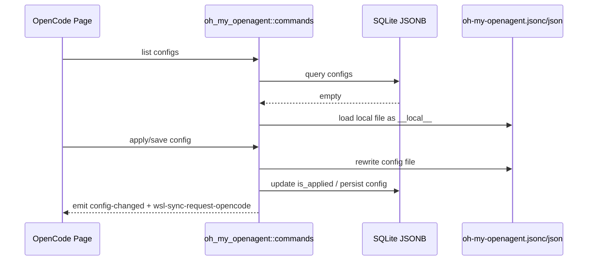

# Oh My OpenAgent 后端模块说明

## 一句话职责

- `oh_my_openagent/` 负责 OpenCode 旁挂的 Oh My OpenAgent 配置、全局配置和本地临时配置到数据库的桥接。

## Source of Truth

- 长期主数据在 SQLite JSONB 表 `oh_my_openagent_config` / `oh_my_openagent_global_config`；旧 SurrealDB 仅用于启动时一次性导入，不再镜像写入。
- 当数据库为空时，页面先看到的是从本地配置文件读取出来的临时 `__local__` 记录；它只是桥接态，不是最终持久化 ID。
- 当前生效配置文件路径由 `runtime_location::get_omo_config_path_async()` 决议，而不是写死默认文件名。
- 写入目标由应用设置 `opencode_use_legacy_oh_my_config` 决定：
  - `false`（默认）→ unified `~/.omo/omo.jsonc`，插件配置整体写入 **[opencode]** 块（新版 oh-my-openagent 唯一读取源）。
  - `true` → legacy 扁平文件 `~/.config/opencode/oh-my-openagent.jsonc`（仅 oh-my-openagent 4.20 之前的旧版本读取）。
- 首次应用前有一次「OMO 是否已升级」二次确认（前端 `useOmoUpgradeGate`）：确认「未升级」会自动打开 `opencode_use_legacy_oh_my_config`。持久化标志 `opencode_omo_upgrade_confirmed` 记录「已确认」，取消不持久化、下次继续弹。后端不需要感知该确认流程，只提供两个设置字段。
- **已知局限（产品已接受）**：确认门只罩住两个显式 apply 入口（设置面板应用 + 顶部选择器切换）。编辑已应用配置自动 re-apply、保存全局配置 re-apply、toggle disabled、托盘 apply、备份恢复/启动 re-apply 等后端写路径**不会**弹确认、直接按当前开关写 unified/legacy。存量用户若未先走显式 apply 而直接改全局配置，首写可能绕过确认。

## 核心设计决策（Why）

- 该模块必须兼容历史文件名 `oh-my-opencode.*` 和新文件名 `oh-my-openagent.*`，否则升级用户会直接丢失本地配置。
- 新版本 oh-my-openagent 的 OpenCode 插件只读 `~/.omo/omo.jsonc`（含项目 `.omo/omo.jsonc`），legacy 文件唯一例外是被插件启动迁移引擎导入。因此写错目标文件会「看起来成功但完全无效」。
- unified 读写在 `commands.rs` 通过 `flatten_omo_config` / `write_unified_omo_config` / `remove_opencode_block` 实现，保持「一个 DB 模型 + is_applied」不变：apply 时把全局字段 + 生效方案合并成一份扁平结果写入 **[opencode]** 块。
- 应用配置统一走 `apply_config_internal`：写文件、更新 `is_applied`、发 `config-changed` 和 `wsl-sync-request-opencode`。
- agents key 统一做小写归一化，避免历史配置里的大小写差异造成逻辑分叉。

## 关键流程

## 易错点与历史坑（Gotchas）

- 不要把 `__local__` 当成可长期引用的真实记录 ID。它只是数据库为空时的临时桥接态。
- 前端 UI 即使后端把 `__local__` 标成已应用，也不要显示「已应用」标签、选中高亮或「应用」按钮；只保留本地来源提示。用户应先保存收编入库，再进入正式 applied 管理语义。
- 保存 `__local__` 到数据库时，要区分“整个 profile/global section 未传入”和“section 已传入但某个 optional 字段为 `None`”。后者代表用户明确清空该字段，不能再回退到本地文件旧值。
- 路径来源不是简单的“默认目录就默认、其它都 custom”，还要兼容旧文件名候选和 `runtime_location` 决议。
- unified 模式下 source 为 `"unified"`（不再走 default/custom 判定）;`flatten_omo_config` 会把 base 键与 `[opencode]` 块摊平（块胜出），并剔除 omo 控制键（`profiles`/`_migrations`/`models`/`task`/`teams`/`codegraph`/`$schema`），避免它们被当成 `other_fields` 写回 `[opencode]` 造成污染。
- unified 写入必须**保留**既有共享键（codegraph/models/task/teams/profiles 等），只替换 `[opencode]` 块；并写 `_migrations` 标记 `2026-07-opencode-config-unification` 阻止插件启动迁移重复导入残留 legacy 文件。
- unified 模式下 legacy upgrade 按钮如果检测到默认旧扁平文件（`~/.config/opencode/oh-my-openagent.*` / `oh-my-opencode.*`），必须把其插件配置迁移到 `~/.omo/omo.jsonc` 的 `[opencode]` 块并移除旧文件；否则 banner 会因为同一旧文件存在而反复出现。迁移时仍要保留 unified 文件里的共享键。
- unified 模式写出的 `[opencode]` 块**不写 `lsp`**（lsp 已不是插件合法 schema 键，写了报 Unknown key）;DB 与 UI 仍保留 lsp，legacy 模式照旧写。
- unified 模式 `apply_config_to_file_public` 在合并完 `plugin_config` 后、写文件前，用 `strip_unified_unknown_keys` 按 `OMO_UNIFIED_UNKNOWN_KEYS` 黑名单（`google_auth`、`lsp`）剔除顶层非法键——它们会从 `other_fields` 平铺或 legacy 迁移泄漏进 `[opencode]` 块，触发上游 doctor "Unknown config key"。黑名单只增不减，新增上游 schema 驱逐的键时追加到这里，不要改成白名单（会漏放行未来上游新增合法键）。
- `[opencode]` 块内 agent/category 的模型/推理字段必须对齐上游 `2026-08-reasoning-unification` 产物：写 `reasoning`（不是 `variant`）；有主模型+回退时合并成有序 `models` 数组（首项为主模型），不再写顶层 `model`+`fallback_models`；只有主模型无回退时保留 `model` 单字符串。读侧（前端 `OhMyOpenAgentConfigModal` 初始化/导入）兼容老 `variant`/`fallback_models`/`models` 回填，写入只产出新字段。`ultrawork`/`compaction` 子对象内同理 `variant`→`reasoning`。issue #286。
- 改应用逻辑时要记住它属于 OpenCode 运行时的一部分，所以 WSL 同步事件也复用 `wsl-sync-request-opencode`。
- “清除已应用配置”只删除当前决议到的运行时配置并取消 `is_applied`，不删除数据库里的 profile，也不是任意路径/文件名映射能力。`__local__` 不应开放该危险操作。
- unified 模式下清除已应用**只移除 `[opencode]` 块**（共享文件不能整个删）；仅剩 `$schema`/`_migrations` 等控制键时才删除文件。legacy 模式仍是删除整个文件。
- **仅 legacy 模式**：在 Windows + WSL 自动同步开启时，清除已应用配置必须先显式删除 `opencode-oh-my` 的 WSL 目标文件，再删除本机文件并取消 `is_applied`；不要只发 `wsl-sync-request-opencode`，因为普通同步会跳过不存在的源文件，不会删除远端旧文件。**unified 模式绝不能整删 WSL 侧 `~/.omo/omo.jsonc`**（共享文件含 codegraph/models），只移除 `[opencode]` 块并靠 `wsl-sync-request-opencode` 同步去除远端该块。
- unified 模式 `~/.omo/omo.jsonc` 是**共享统一配置**；`opencode-oh-my` 的 WSL/SSH 同步目标在 unified 模式下应指向 `~/.omo/omo.jsonc`（legacy 才用 `~/.config/opencode/...`），默认 mapping 已改为 unified 路径。

## 跨模块依赖

- 依赖 `runtime_location` 决议当前配置文件路径。
- 被 `web/features/coding/opencode/` 页面中的 Oh My OpenAgent 相关组件依赖。
- 与 OpenCode 主配置、WSL 同步和托盘刷新语义相邻。

## 典型变更场景（按需）

- 改文件名或路径决议时：
  同时检查新旧文件名兼容、本地 `__local__` 加载和应用后的落盘路径。
- 改 agents/global config 保存时：
  同时检查 `is_applied`、全局字段保留和 WSL 事件。

## 最小验证

- 至少验证：数据库为空时能从本地文件生成 `__local__` 临时配置。
- 至少验证：应用配置后写入正确文件，并触发 `wsl-sync-request-opencode`。
