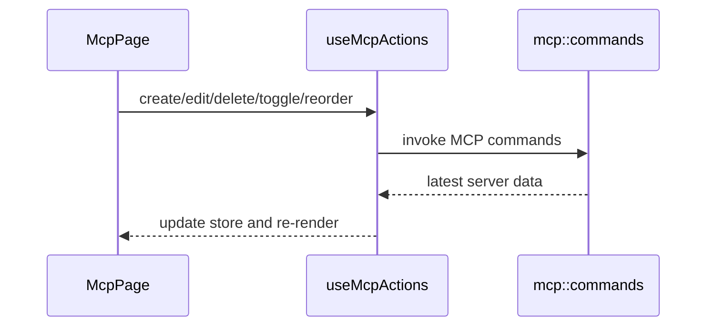

# MCP 前端模块说明

## 一句话职责

- `mcp/` 页面负责 MCP server 的展示、增删改、导入和排序，以及按工具开关同步状态的交互。

## Source of Truth

- 页面列表数据来自后端中心存储，不直接以任何单个工具配置文件为准。
- 工具可安装状态、可同步目标和扫描结果分别来自 hooks 与后端命令，不由页面本地推断。
- 排序的持久化以 server `sort_index` 为准，前端拖拽顺序只是即时 UI 表现。
- `user_group/user_note` 是 AI Toolbox 内部的用户管理元数据，事实源是后端 `mcp_server` 记录，不是 MCP server 自身配置或工具运行时配置文件。
- `tags` 与 Skills 同一套标签语义：归一化去重、确定性颜色 hash、`UNTAGGED_FILTER` 哨兵筛选。事实源是后端 `mcp_server.tags` 数组；详情面板是唯一编辑入口。

## 核心设计决策（Why）

- 页面把“server CRUD”“工具同步切换”“导入已有配置”“排序”拆给不同 hooks/store，避免一个组件承载全部副作用。
- 拖拽排序采用先本地重排再提交 `reorderServers`，这样交互更顺滑。
- MCP 页不自己实现底层同步逻辑，只做中心存储和工具勾选的前端入口。
- 自定义分组只影响页面组织和搜索，不改变 MCP server 配置，也不改变同步到各工具的目标路径。
- 分组视图不开放拖拽排序；排序只在平铺模式中修改全局 `sort_index`，避免把“改分组”和“改排序”混成一个交互。
- MCP 卡片采用与 Skills 同款三区布局（`McpCard.module.less`）：头部行 = 状态槽 + 名称 + hover 渐显操作簇（复制命令/地址 + 刷新 + 更多）；主体 = 描述 + 单行标签行（tags → group → note），三者皆无时整行不渲染；底部 meta 栏 = 来源按钮 + 工具同步 icon pill，不展示最后编辑时间。`onEdit` 编辑服务器配置收进更多菜单，不在头部单独放铅笔按钮。
- MCP 详情采用右侧 `Drawer`（宽度 `min(60vw, 760px)`，`destroyOnHidden`、`closable={false}`、body padding 0 + flex column），由 `McpDetailPanel` 渲染只读派生视图；卡片正文点击仅在浏览模式打开，选择模式和拖拽手柄通过 `data-mcp-card-no-detail` 排除。
- MCP 标签系统复用 Skills 标签工具（`web/features/coding/skills/utils/skillTags.ts`，经 `mcp/utils/mcpTags.ts` 转发）：工具栏 `TagFilterDropdown` 支持搜索/多选/未打标签哨兵；搜索关键词同时匹配 tags；卡片只展示标签行；详情面板通过行内 add/remove 编辑，persist 走 `mcp_update_metadata` 的 `tags` 参数。
- MCP 顶部工具栏与 Skills 对齐：主视图切换（平铺/分组）仍作为工具栏表面的 shared `ManagementSegmented`，平铺排序、浏览/选择、组工具等辅助配置收进 sliders 选项浮层（antd `Popover`，click / bottomRight / 无箭头，模块样式只负责内部布局）。浮层固定两分区「视图与筛选 / 数据管理」：即时生效的模式切换用 `ManagementSegmented`，打开 modal 的数据管理动作（导入现有 MCP / 导入 JSON / 设置）用 `ToolbarActionItem` 按钮，点击时先关浮层再进流程。只要浮层内存在非默认状态，触发按钮就带 `.toolbarOptionsTriggerActive` 的可见 active feedback（含 `::after` 圆点）；禁用原因要在浮层内有 `.toolbarOptionHint` 轻量可见提示，不能只依赖 hover title。

## 关键流程

## 易错点与历史坑（Gotchas）

- 不要在前端直接推导某个工具配置文件里“应该有什么 MCP server”；真正真相在后端中心存储。
- 拖拽排序时，本地 UI 顺序和后端持久化必须一起更新；只改其中一边会导致刷新后回弹。
- 导入成功后要回到 scan/result 刷新链路，不要只关弹窗不刷新列表。
- 不要把 MCP 自身的 `description` 和 AI Toolbox 管理备注 `user_note` 合并存储；卡片展示可以在 `user_note` 为空时回退展示 `description`，但编辑入口必须分开。
- MCP stdio 的 `command` 字段是可执行文件路径，不是 shell 命令行字符串；Windows 路径和 JetBrains runtime 路径可能合法包含空格。前端保存、导入和编辑时不能按空格拆分 `command`，参数只来自显式的 `args` 数组。
- MCP 卡片的命令包版本只处理 stdio `npx/pnpx/tpnx` 与 `uv/uvx` 这两类 runner；不执行升级、不调用 CLI、其他 `command` 不展示版本。未 pin 或 `@latest` 的包名可异步查询 npm/PyPI registry 后展示真实最新版本号；查询失败时不要把 `latest` 伪装成具体版本。
- JSON 导入既要支持 `{ mcpServers: { name: config } }` / `{ name: config }` 这类带 server 名称的映射，也要兼容用户从工具里复制出来的裸单 server 配置对象。裸对象没有名称时可以使用稳定默认名，再交给重复名处理流程。
- 组工具模式只是分组视图里的前端批量控制模式，未分组不参与启用时的统一和组级工具控制；卡片工具列表仍展示，但卡片内工具添加/移除入口应只读禁用，点击时提示用户到分组标题后操作。MCP 工具开关是 toggle 语义，批量添加/移除前必须先按 `enabled_tools` 过滤目标 server，不能对整组无脑 toggle。
- `preferred_tools` 是添加/导入 MCP 时的默认同步目标；“添加更多仅显示常用工具”只限制普通 MCP 卡片 `+` 菜单的候选工具，不自动移除已启用工具，也不收窄批量添加或分组工具模式这类管理入口。
- MCP 管理页可能出现几百个 server，平铺和分组展开都应使用 shared `management/VirtualGrid` 这类可视区渲染；拖拽排序模式保持完整列表渲染，避免虚拟化与 dnd-kit 排序语义冲突。
- 拖拽排序模式也是完整列表渲染，「每行展示自动」(`gridColumnSetting === 'auto'`) 时不要另写一套私有列数或固定 2 列布局；要复用 `shared/management/useAutoGridColumns` 让排序分支与浏览（`VirtualGrid`）分支用同一套容器宽度 → 列数公式，避免同一行卡片数在两种模式间漂移。`.list` 的 `--management-grid-columns` CSS 回退值也要选接近宽屏 auto 结果的常数（`repeat(3, minmax(0,1fr))`），避免 `ResizeObserver` 首个回调前首帧跳列。
- MCP 管理页、列表、分组和卡片的主交互面应保持轻量原生控件风格，不要重新把 AntD `Button/Input/Segmented/Dropdown/Tooltip/Collapse/Empty/Spin/Tag/Checkbox` 引回这些高频列表 surface；复杂 modal 表单可另行按 modal 规则处理。
- 新增/编辑弹窗里 stdio 的 `args`（以及表单中的 `env`/`headers` 列表）支持 dnd-kit 拖拽排序，因为 CLI 参数顺序会影响执行；排序只改 Form.List 顺序，保存时仍按数组原样写入 `server_config`，不要在提交时 re-sort。
- 超时设置在同一个表单区块里合并展示，但语义不能混：顶层 `timeout`（毫秒）只给 OpenCode；`server_config.startup_timeout_sec` / `tool_timeout_sec`（秒）给 Codex 与 Grok。保存时毫秒字段仍写 `timeout`，秒级字段写进 `server_config`；留空都不落盘，让各工具用默认值。
- MCP 卡片/详情面板/添加工具菜单的工具同步入口统一用共享 `ToolIcon`（`web/features/coding/shared/toolIcon/ToolIcon.tsx`）渲染，不再展示文字 pill。MCP `McpTool.key` 与 ToolIcon 的 toolKey 是同一套工具 key；`icon_url` 经 `mcp_get_tools`（返回 `RuntimeToolDto`）透传，后端已含该字段，前端类型 `McpTool.icon_url` 直接消费，无需改后端。
- MCP 详情面板 env/headers 直接展示完整值（`KEY: value` 一行，`KEY` 后冒号分隔），不做脱敏/省略，保留右侧复制按钮；长值允许换行（`overflow-wrap: anywhere`）。版本号只作为派生信息附加在顶部 source 行（`command · version`），详情面板不再有独立的“版本”section（曾位于最底部的版本区已删除，i18n 键 `mcp.detail.version`/`versionSection` 不再使用）。meta 卡只有“分组”一行作为标题/主体（`mcp.metadata.edit` = 分组用于卡片菜单与 footer 入口），meta 卡内右侧铅笔按钮用 `common.edit`（“编辑”）而不是“分组”；备注是附属，没有备注时不渲染“备注: 暂无备注”行。详情工具区与 Skills 一致：已启用（synced）工具排在前面，未启用排后。
- `McpCard` 的删除确认由 `McpPage` 统一弹 `Modal.confirm`；`McpDetailPanel` 的删除按钮直接调用 `onDelete`（页面级会关闭抽屉并弹确认），不要在面板内再包一层确认，避免双重弹窗。
- MCP 管理启用/禁用（`management_enabled`）语义与 Skills 对齐：禁用会从当前工具取消同步并记录历史绑定，重新启用必须走「`enableServer` 恢复管理状态并取回历史工具 → `getRestorableToolIds` 基于 `disabled_previous_tools` 过滤出可恢复工具 → 用户确认 `restoreTools`」的 restore 链路；不要只 patch `management_enabled` 或新建绕过该链路的快捷状态。禁用后 server 仍保留在原分组内，禁用筛选只是 UX 派生状态。
- 批量启用/禁用与单卡共用同一套 `management_enabled` 语义：批量入口的内部 id 集合必须在 handler 内部按方向选择（enabled 时用 `selectedDisabledServerIds`、disabled 时用 `selectedEnabledServerIds`），不要用整份选择集无脑 toggle；批量 enable 前先为每个受影响 server 聚合 restore 候选，onOk 里逐个 `batchSetManagementEnabled → restoreTools`，成功后 `refresh()` 并清空选择集。失败提示用 `mcp.batch.enableFailed/disableFailed`。
- 启用/禁用菜单的每个 entry 必须独立判定 `disabled`（禁用入口看 `selectedDisabledServerIds`、重新启用入口看 `selectedEnabledServerIds`）；只选了一类 server 时，另一方向入口照常可用，绝不能因为「整批没有可禁用的项」把重新启用入口也一起禁掉。
- 「视图与筛选」弹层首行是与 Skills 完全同款的「启用状态」分段筛选（`mcp.enabledFilter.*`），过滤链固定为 管理状态 → 标签 → 搜索；卡片三点菜单顺序与 SkillCard 对齐（编辑元数据 → 禁用服务器/启用 → 编辑配置 → 删除），`onSetManagementEnabled` 未接线时整体省略切换项，绝不渲染空 label 占位行；状态点语义统一以 `management_enabled` 为准（卡片与详情面板都是启用=绿色 success 点）。
- 「数据管理」弹层区与 Skills 同款两项：「分组管理」（`McpGroupsModal`，后端 `mcp_group` 实体表 + `mcp_list/save/delete_group` 命令，字段与 SkillGroupRecord 一致；服务器成员关系仍按 `user_group` 文本匹配——后端保存时重命名会同步改组内服务器文本、删除会清空同名文本，前端 invoke 参数名是 `groupId` 不是 `id`）与「分组导入/导出」（`McpInventoryModal` + 后端 `mcp_{export,preview_group_inventory_import,apply_group_inventory_import}` 命令，JSON 形如 `{schema_version, groups:{组名:[服务器名]}}`，只动分组不动配置；store 的 `update_mcp_server_metadata` 对 None 是“清除”语义，保留 note/tags 必须显式回传）。
- 引用后置 `useCallback`/`useMemo` 的依赖数组会在渲染求值时触发 TDZ（TS2448「Cannot access before initialization」）：新增派生 memo 若依赖某个定义在它后面的 handler，必须把 memo 移到该 handler 定义之后，而不是从 deps 里删掉 handler——否则 memo 闭包永久捕获首渲染的陈旧状态。

## 跨模块依赖

- 依赖 `useMcp`、`useMcpActions`、`useMcpTools` 和 `mcpStore`。
- 依赖后端 `mcp::commands` 提供 CRUD、导入、排序和同步能力。
- 与 `settings/` 和 `wsl/` 间接相关，但页面本身不直接处理 WSL 自动同步。

## 典型变更场景（按需）

- 改排序或批量导入时：
  同时检查 store 更新、后端持久化和导入后 reload。
- 改工具开关 UI 时：
  同时检查 tool availability、toggle action 和同步结果提示。
- 改自定义分组时：
  同时检查平铺/分组切换、搜索匹配、卡片第二行展示和右侧两按钮操作区。

## 最小验证

- 至少验证：新增、编辑、删除、切换工具、拖拽排序都能刷新到正确列表。
- 至少验证：导入已有配置或 JSON 后，列表和扫描结果都会更新。
