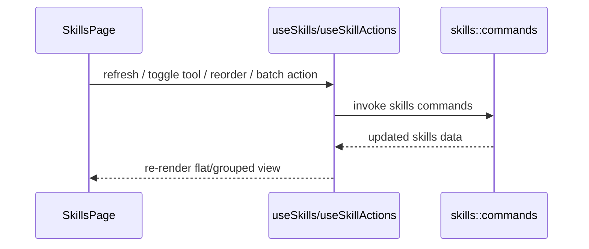

# Skills 前端模块说明

## 一句话职责

- `skills/` 页面负责技能列表、中央仓库视角下的来源展示、导入安装、批量启停和同步相关交互。

## Source of Truth

- 技能主数据以后端 Skills 中央仓库和数据库记录为准，不以前端当前排序或分组结果为准。
- grouped/flat 视图、搜索、批量选择都是纯 UI 衍生状态，不能反向当成业务事实。
- 技能来源标签展示的是中心存储的 `source_type/source_ref` 语义，不是工具运行时目录扫描结果本身。
- 手动分组事实源是后端 `skill_group` 表和 `skill.group_id`；`user_group` 只是旧数据/展示兼容字段，不要再把 group name 当业务身份。
- `user_note`、`tags`、`management_enabled`、`disabled_previous_tools` 是 AI Toolbox 内部用户管理元数据，事实源是后端 `skill` 记录，不是 `SKILL.md` 或工具运行时目录。`tags` 是 string 数组，adapter 缺省为空数组，不参与内容哈希、不触发工具同步。
- Skill description 只来自后端对中央仓库 `SKILL.md` frontmatter 的缓存解析；前端不能把 description 写回 DB，也不能塞进 Inventory JSON。
- `source_health/source_error` 是后端对中央仓库 source 的只读诊断；前端只能标黄提示用户手动恢复或重装，不能据此自动恢复、删除或触发重同步。

## 核心设计决策（Why）

- 页面默认站在“中央仓库”视角组织技能，而不是站在某一个工具目录视角，因为真正的 source of truth 是中央仓库。
- grouped view 按来源分组，flat view 按单个 skill 操作；两种视图服务不同任务，不能强行合并成一种。
- 自定义分组只影响页面组织和搜索，不改变中央仓库目录结构，也不改变同步到各工具的目标路径。
- 手动分组是 first-class registry，用稳定 `group_id` 维护归属；应用内重命名 group 只改分组记录，组内 skill 归属保持不变。
- Inventory JSON 是完整管理清单覆盖语义，不是局部 patch，也不是 skill 内容备份；导入导出只改管理元数据和工具同步状态，不改写中央仓库内容。
- 批量操作和拖拽排序是相邻高频场景，因此交由 `useSkillActions` 集中处理，避免页面里散落大量 mutation 逻辑。
- Skill 详情采用右侧抽屉（AntD `Drawer`，宽度约占屏幕 60%）承载 `SkillDetailPanel`：浏览模式下点击卡片正文打开抽屉，面板内容（来源标识、文档预览、元数据、工具开关、更新/禁用/删除）都是同一份 skill 与工具数据的只读派生，不是第二套业务事实源。列表区保持独立宽度，不因抽屉压缩布局。
- Skill 卡片与详情面板的工具同步入口统一用共享 `ToolIcon` 组件渲染品牌图标，不再展示文字 pill；同步状态靠"透明度 + 描边"表达（已同步 = 正常透明度 + 实线边框，未同步 = 降透明度 + 虚线边框），hover 时恢复实线全透明度，不依赖颜色区分。卡片"+"添加工具菜单、批量添加/移除工具菜单的每个 menu item 也要带 `ToolIcon`（`icon` 字段），与列表入口视觉一致。

## 关键流程

## 易错点与历史坑（Gotchas）

- 详情面板只应在浏览模式（非 selectionMode、非拖拽手柄）由卡片正文点击打开；选择模式下卡片点击应留给选择，不要既开详情又选卡。拖拽手柄通过 `data-skill-card-no-detail` 排除，避免拖拽时误开详情。
- 不要把工具当前 skills 目录当成源目录。页面展示和操作都应默认以中央仓库为中心。
- 不要把自定义分组和来源分组混为同一个业务概念；来源分组来自 `source_type/source_ref`，手动分组来自 `skill_group` + `group_id`，`user_group` 只用于兼容展示。
- grouped view 的展开状态、搜索过滤和选择集都是 UI 派生状态，刷新时只能做裁剪，不能把它们误当成业务配置保存。
- `default_view_mode` 保存用户进入 Skills 页时的默认展示偏好；设置保存成功后也应立即应用到当前 Skills 页面视图，但不能保存或推导当前页面搜索、展开、筛选、选择集等运行时状态。
- 组工具模式只是自定义分组视图里的前端批量控制模式。开启时可按组内工具并集补齐各 Skill，但不能新增配置组/Profile 事实源，也不能应用到来源分组、未分组或搜索后的局部结果；卡片工具列表仍展示，但卡片内工具添加/移除入口应只读禁用，点击时提示用户到分组标题后操作。
- 组工具模式里的“统一并开启”和分组标题 `+` 添加工具，都是用户已确认的分组级写入路径；补齐缺失工具时应显式覆盖工具目录中同名但未被当前 DB `sync_details` 记录的目标，避免裸 `TARGET_EXISTS|...` 中断。普通单项/批量同步仍保留默认非覆盖防护。
- 批量操作改动较大时，别忘了刷新列表，否则 grouped/flat 两种视图很容易出现旧状态残留。
- `management_enabled=false` 的 skill 仍保留在原分组内；禁用筛选只是 UX 派生状态。禁用入口不能让“重新启用”菜单也被禁用，否则用户无法恢复。
- `management_enabled=false` 的 skill 不能被批量添加工具、组工具模式补齐、新工具同步等前端批量入口重新同步；这些入口应跳过禁用项，后端 `skills_sync_to_tool` 仍是最终保护线。
- 重新启用 skill 时要用后端返回/记录的 `disabled_previous_tools` 让用户确认恢复哪些工具，再复用现有 `skills_sync_to_tool`；不要在前端新增一套 Inventory 导入时的工具可用性阻断逻辑。
- 批量启用/禁用也必须复用选择模式和 `skills_set_management_enabled` 语义；批量启用需要统一确认历史工具恢复，批量禁用需要统一提示会取消同步并记录历史绑定，不要只 patch `management_enabled` 或新增绕过现有恢复链路的前端快捷状态。
- Inventory JSON 导出必须始终导出完整清单，包括当前被筛选隐藏或禁用的 skill；JSON 不包含内部 `group_id` 和 `description`，skill 通过 group name 引用分组。主交互采用文件导出/文件导入，不在 modal 中粘贴大段 JSON。
- Inventory JSON 导入是完整 desired-state 覆盖：`enabled_tools` 需要真正对齐工具同步状态；未出现在清单里的本地 skill 默认禁用时不要保留旧 `group_id/user_group`，否则会重新冒出不在 registry 里的 legacy 分组。
- “复制给 AI 整理”应复制面向文件工具的 prompt：先确保有导出的 `~/skill-group-{timestamp}.json` 路径，再要求 agent 读取该文件并输出/写入可导入 JSON 文件，避免聊天框承载巨型 JSON。
- Skill 卡片里的本地来源文件夹图标只负责打开原始来源 `source_ref`，不能 fallback 到中央仓库 `central_path`；本地来源不存在时提示用户原始来源目录已丢失。打开目录用后端 `open_existing_folder`，不要直接用 Tauri opener 的 `openPath`，否则容易被 opener path scope 拦截；定位 `SKILL.md` 时不要硬编码 `\\SKILL.md`，应保留当前路径风格拼接分隔符。
- 单项/批量输入不存在的分组名时，应先调用 `skills_save_group` 创建 first-class group，再把 skill 绑定到返回的稳定 id；不要静默保存成未分组。
- Skills 管理页面向几百个条目时应优先使用 shared `management/VirtualGrid` 和按需菜单；普通浏览/分组展开可以虚拟化，拖拽排序模式保持完整列表渲染，避免虚拟化与 dnd-kit 排序语义冲突。
- Skills 管理页、列表、分组和卡片的主交互面应保持轻量原生控件风格，不要重新把 AntD `Button/Input/Segmented/Dropdown/Tooltip/Collapse/Empty/Spin/Tag/Checkbox` 引回这些高频列表 surface；复杂 modal 表单可另行按 modal 规则处理。
- Skill 卡片视觉采用参考 skills-manager 的三区布局（`SkillCard.module.less`）：头部行 = 状态槽（选择模式 checkbox / 拖拽手柄 / 管理状态点）+ 名称（hover 变 `--color-primary`）+ hover 渐显操作簇（打开目录/复制/更多/更新）；主体 = 描述 + 单行元信息行（顺序固定：tag pills → 分组 pill → 备注文本，三项全空时整行不渲染）；底部 meta 栏 = 来源按钮（点击开 repo/来源目录）+ 相对时间 + 工具同步位，用 `border-top` 分隔；来源按钮里的 svg 必须保持 `flex-shrink: 0`（只压缩截断文字，不压缩图标），卡片文字可省略号，但**详情面板的 repo 引用必须完整换行展示（`overflow-wrap: anywhere`），不做省略号**。Skill 卡片不再使用共享 `ManagementCard` 的左图标布局（自定义 `styles.card` flex-col 结构）；不要往共享 `ManagementCard` 加 skills 专属能力。
- Skills 页面的文字对比度规则（ui-ux-pro-max 检索结论：灰上灰/低对比是 High 严重度问题，正文需 ≥4.5:1）：承载信息的文字（描述 lead、分区标题、来源行、路径、meta 标签与值、工具名、空态/提示文案、页面 hint、结果计数）一律用 `--color-text-secondary` 起步，关键内容（描述 lead、meta 值、工具格名称）用 `--color-text-primary`；`--color-text-tertiary` 只允许用于纯装饰或刻意弱化场景（placeholder、禁用态卡片、hover 才显现的渐隐按钮初始色、箭头图形）。新样式不要把正文/标签默认写成 tertiary。
- 品牌主色 token 是 `--color-primary`（亮 `#1890ff` / 暗 `#1668dc`，与 antd `colorPrimary` 对齐，定义在 `web/App.css`）。此前多个模块引用的 `--color-primary` 在 2026-08 之前实际未定义、静默失效；新样式需要主色强调时直接用这个 token，不要再写 `var(--ant-color-primary, #1677ff)` 这类带硬编码兜底的引用。
- Skills 顶部工具栏的表面只保留最高频主视图切换（平铺/分组）作为 shared `ManagementSegmented`；禁用筛选、平铺排序、自定义/来源、浏览/选择、单卡/组工具等辅助查看或组织配置收进 sliders 选项浮层，并在浮层内继续使用 shared `ManagementSegmented`。分组管理和 Inventory 分组导入/导出这类组织类一次性动作放在 sliders 浮层的管理动作分区内，用按钮呈现；展开/折叠这类快捷动作保持 icon button，其他低频入口可继续放按钮或更多菜单，避免把动作误设计成状态。只要 sliders 浮层里存在非默认状态，触发按钮必须给出可见 active feedback；禁用原因要在浮层内有轻量可见提示，不能只依赖 hover title。
- sliders 选项浮层的信息架构固定为“视图与筛选 / 数据管理”：即时生效的筛选、分组、模式切换使用轻量一体化 segmented；会打开 modal 或文件流程的分组管理、Inventory 导入导出使用列表 action item，并在点击时先关闭浮层再进入流程。不要把 action item 重新做成 segmented 或把 segmented 包进多层线框卡片。
- Skill 卡片不要重复展示已有上下文：所属分组只在需要补充归属的视图中弱化呈现，分组视图已有 section/header 提供归属时不要在卡片内重复。`description` 摘要、`user_note` 管理备注等可选文本渲染前先 trim，避免空白字段撑出空内容块；具体展示层级应服从当前页面设计，不把一次性视觉回滚固化为长期卡片结构规则。
- Skill 卡片打开路径交互必须区分两个入口：中央仓库入口优先定位 `central_path/SKILL.md`，失败或缺失时 fallback 到 `central_path`；本地来源文件夹图标只打开 `source_ref`，不 fallback 到 `central_path`。启用/禁用属于低频维护动作，收进更多菜单但不能禁用恢复路径。
- “更新全部”是 top 工具栏的全局动作（`updateAllSkills`），走后端聚合的 `skills_update_all`，确认后按 `updated/errors` 数量给出全部成功或部分失败提示；它和 grouped/selection 下的“批量刷新”（逐个 `updateManagedSkill`）不同，两者都复用后端单 skill 更新链路，但批量刷新不会聚合。更新过程中复用 `actionLoading`/`updatingAll` 禁用入口，避免重复触发。
- 定时自动更新配置放在设置弹窗：模式分“每天定点 HH:MM”和“自定义 5 字段 cron”（`分 时 日 月 周`），统一以 cron 字符串存后端（`getAutoUpdate`/`setAutoUpdate`）。每天模式只在回填补进纯 `"mm hh * * *"` 形态时才显示为 daily，其余一律落到自定义表达式输入框。
- 工具图标解析顺序（`ToolIcon.tsx`）：**1) tab 优先**——凡是 MainLayout 导航 tab 有对应图标的工具，一律用 tab 同款：本地资产 mark（`claude_code`/`claude_desktop`→`claude.svg`、`codex`→`chatgpt.svg`、`opencode`→`opencode.svg`、`pi`→`pi.svg`、`oh_my_pi`→`omp.svg`，其中 claude_code/pi/oh_my_pi 为手写内联组件，claude_desktop/codex/opencode 走 `?raw` 内联进 `RAW_SVG_MARKS`，都不要改回 `` 资产 URL——img 方式在运行环境实测不渲染）和 LobeHub 组件（`grok`→`Grok`、`gemini_cli`→`Gemini.Color`（与 geminicli tab 一致，不用 GeminiCLI mark）、`hermes`→`HermesAgent`、`dsh`→`DeepSeek.Color`、`openclaw`→亮色 `OpenClaw.Color`/暗色 `OpenClaw` mono）；**2) 参考项目拷贝**——LobeHub 和 tab 都没有的（`droid`、`qclaw`/`easyclaw`/`autoclaw` 共用 OpenClaw 族爪印、`workbuddy`/`workbuddy_ai`）来自 `web/assets/agent-icons/`（MIT，来源映射见同目录 `NOTICE.md`），SVG `?raw` 内联、PNG ``；从参考项目拷贝 SVG 时注意它的 AgentIcon 是放在浅色圆角底板上展示的，**带纯色底 rect 或浅色图案的 SVG 必须先去底并把图案改成 `currentColor`**（droid.svg 已这样处理），否则内联后是黑块或在暗色下不可见；还要**检查悬空的 `clip-path="url(#id)"` 引用**——参考项目部分 SVG 引用了不存在的 defs id，`` 渲染时浏览器宽容，但内联进 DOM 时无效 clip-path 会让整个分组不渲染（图标完全空白，droid.svg 踩过），拷贝后应去掉无效引用或重建为干净的单层 `svg + path`；`currentColor` 图标依赖 `.rawIcon` 显式的 `color: var(--color-text-secondary)` 兜底——按钮等控件不会继承文字 color，去掉这个兜底会让 mono 图标在暗色主题下变黑不可见；**固定色 fill 的 raw mark（claude/chatgpt/opencode/openclaw 族，如 chatgpt.svg 的 `rgb(9,9,11)` 近黑）暗色下必须走 MainLayout tab 图标同款 CSS 处理**：`.rawIconFixedColor` 类在 `[data-theme='dark']` 下统一 `filter: invert(1) hue-rotate(180deg)`（反转亮度、保留色相），而 `currentColor` mark（`CURRENT_COLOR_RAW_MARKS`，目前只有 droid）自适应、**绝不能**带这个类否则双重反转回黑不可见；不要为暗色适配复制资产副本（增加包大小），也不要按 LobeHub 组件做暗色反转集合（LobeHub 自己处理主题）；**3) 其余 LobeHub 品牌**——`TOOL_ICON_RENDERERS` 映射，优先 `.Color` 彩色变体（如 `Qwen.Color`），无 Color 变体的用 mono 组件；**renderer 路径必须包在 `.iconHost` 宿主 span 里**（`color: var(--color-text-secondary)`）——lucide `Globe`（shared_agents）和 LobeHub mono 组件都是 `currentColor`，而 button/菜单项的 UA 样式不继承页面文字色，裸渲染时 currentColor 落回黑色、暗色主题下不可见（shared_agents 的 Globe 踩过，实测裸 button 内 0px 可见、iconHost 内 909px）；`.Color` 变体固定填充不受宿主 color 影响；**4) 自定义工具 `iconUrl`**（http(s) 图片链接，存后端 `custom_tool` 表，设置弹窗“添加自定义工具”录入并校验 http 前缀），渲染为 ``，调用方从 `ToolOption.iconUrl`/`ToolInfo.icon_url` 透传；`icon_url` 必须贯穿 `skills_get_tool_status` 的 `ToolInfoDto`（`RuntimeToolAdapter` → `ToolInfoDto`），这条命令是卡片/详情面板/设置弹窗三处工具列表的唯一数据源，只在 `RuntimeToolDto`/`CustomToolDto` 加字段会让 Skills 页拿不到图标；**5) 兜底两字母徽标**（无任何图标来源的工具）。`shared_agents`（agentskills.io 公共共享目录，无品牌 mark）不走徽标：按参考项目对"无图标网络来源"的约定，在 `TOOL_ICON_RENDERERS` 里映射 lucide `Globe` 线稿（currentColor 自动适配明暗）。新增内置工具时按此顺序补映射。
- 预览"最近 10 次触发时间"由前端对当前 `schedule` **防抖 300ms** 调 `previewAutoUpdateSchedule` 实时刷新；预览与执行共用后端 cron 引擎，避免两套解析器不一致。非法表达式时输入框不阻断编辑，预览区显示后端错误提示即可。实际调度由后端 `auto_update` 任务在后台静默执行，前端不监听其结果。
- tag 增删的唯一入口是详情面板（skills-manager 约定：卡片 tag 行纯展示）。卡片 tag 行：有 tag 渲染纯展示 pill（无 X 移除、无"+"添加、无行内编辑），无 tag 整行不渲染——不要再给卡片加回编辑控件或用 CSS `:empty` 之类的占位 hack（`:empty` 曾是死代码：行内常驻隐藏按钮导致永不生效）。详情面板 tag 行是原生 span/input 实现（不引回 AntD `Tag`/`Input`），增删走 `updateSkillMetadata` 的 tri-state tags 参数：`undefined` 表示不动 tags，显式数组整体覆盖；无 tag 时显示虚线空态 pill"+ 添加标签"（`.tagAddEmptyPill`，点击打开行内编辑），有 tag 时保留行尾"+"小按钮。卡片 body 有 `flex: 1` 让底部 meta 栏钉底（参考项目 `mt-auto`），无 tag/短描述时卡片视觉骨架稳定。
- tag 颜色按 tag 文本 FNV-1a hash 取固定 8 色板，不是按索引或出现顺序取色，保证同一 tag 跨卡片、跨增删颜色稳定；未知 tag 颜色 class 回退到 `tagColor0`。色板 class 的唯一定义在 `SkillCard.module.less`（`.tagColor0..7`）；`SkillDetailPanel` 和 `BatchTagDialog` 通过导入该 module 复用，不要再复制第三份色板。共享 `GitHubSourceIcon` 统一从 `ToolIcon.tsx` 导出。
- 详情面板的单卡 tag 增删入口在 `management_enabled=false` 时禁用，与批量打标跳过禁用项的语义一致。
- 详情抽屉（`SkillDetailPanel`）按参考项目的面板结构组织：标题区（管理状态点 + 大标题 + 来源按钮行）→ 描述 lead → 标签行 → 中央仓库路径 pill（单击复制、双击定位 `SKILL.md`，mono 字体）→ 分组/备注 meta 卡（分组行带铅笔行内编辑：datalist 补全已有分组、Enter/blur 提交且空值清除分组、Esc 取消；名字→group id 解析和新建分组在页面级 `onUpdateGroup` 回调里做，保存走 `updateSkillMetadata(skillId, groupId, 原user_note, undefined)`，tags 用 tri-state `undefined` 不动；备注行仍只读）→ 工具同步网格（`.toolGrid`，固定一行 4 列、整格点击切换同步；已同步 = 实线边框 + 图标前绿点，未同步 = 虚线边框 + 透明占位点 + 降透明度、hover 恢复并主色描边，tooltip（title）显示"工具名 (该工具解析出的 skills 目录) — 已同步/未同步"（路径来自 `ToolOption.skillDir`，由 store 从 `ToolInfo.skills_dir` 透传，title 与 aria-label 共用同一文案）；不使用行式列表或渐变折叠 mask）→ pill 式文档 tab（激活态主色实底）→ 底部操作条。面板按 `skill.id` 重置 tag 编辑器等局部状态（Drawer 不重挂载，只换 `skill` prop）。宽度 `min(60vw, 760px)`。
- sliders 选项浮层的浮层 chrome（定位、关闭、层级）基于 antd `Popover`（click、bottomRight、无箭头），模块样式只负责内部布局；不要重新手写 portal 定位代码。tag 筛选下拉的选项列表有 `max-height + overflow-y` 上限；`__untagged__` 哨兵与具体 tag 互斥——选中一边会自动清掉另一边，避免 AND 语义下的恒空结果。
- 批量打标（BatchTagDialog）入口只在 grouped 视图 selectionMode 的批量操作栏；flat 视图没有批量选择，单卡增删标签走详情面板。批量打标是追加语义（新 tags 并集，不删除已有 tags），跳过 `management_enabled=false` 的项并展示 skippedCount，成功后清空选择集并刷新列表（tags 是纯元数据，不经 sync 链路）。
- tag filter 是工具栏"添加 Skill"主按钮后的 axonhub 渠道页风格筛选按钮（`TagFilterDropdown` + `.tagFilterTrigger` 系列样式）：虚线 outline 触发器（`PlusCircle` + 标题 + 选中 badge，≤2 个显示各 tag 名、>2 个显示"已选 N 个"），点击弹 antd Popover（搜索框 + checkbox 选项列表 + 每项 skill 计数 + 有选中时的"清除筛选"项）。不要改回工具栏下方的独立筛选药丸行（已移除）。筛选语义不变：与 enabled 筛选叠加（顺序：enabled → tag → 搜索），多个 tag 必须全部命中（AND）；搜索框的命中范围也包含 tags（`filterSkillsBySearch` 的 searchableValues 含 `skill.tags` 展开，与名称/描述/分组/备注一起大小写不敏感匹配）；`UNTAGGED_FILTER`（`__untagged__`）哨兵选项排在列表首位、筛出"无任何 tag"的 skill，且与具体 tag 互斥（选中一边自动清掉另一边）。全部 tag 候选集与"是否存在未打标技能"都以完整 skills 列表为基准；选中项随 skills 变化自动裁剪失效项（`pruneStaleTagFilters`）。选项列表有 `max-height + overflow` 上限，防大标签集撑爆弹层。

## 跨模块依赖

- 依赖后端 `skills::commands` 和 `skills` 模块已有的中央仓库、同步引擎语义。
- 依赖 `useSkillsStore`、`useSkills`、`useSkillActions` 和多个 modal 组件。
- 与 `wsl/`、`ssh/`、`skills/` 后端紧密相关，但前端自身不负责决定同步目标路径。

## 典型变更场景（按需）

- 改分组逻辑时：
  先确认是在改展示分组，还是在改业务来源语义；这两者不要混。
- 改 Inventory JSON 时：
  同时检查文件导出、文件选择、preview、apply、确认弹窗和重新读取列表；特别确认未匹配本地 skill 的默认禁用数量会展示给用户。
- 改禁用/恢复逻辑时：
  同时检查卡片菜单可用性、历史工具恢复确认、group 归属是否保持不变，以及工具同步入口是否仍复用后端既有错误处理。
- 改批量操作时：
  同时检查 selection 清理、分组视图和 refresh 行为。

## 最小验证

- 至少验证：搜索、平铺/分组切换、批量选择、批量刷新/删除仍一致工作。
- 至少验证：导入或安装新 skill 后列表能回到中央仓库视角正确展示。
- 涉及 Inventory JSON 或禁用状态时，至少验证：导出完整清单文件、复制整理 prompt、选择 JSON 文件预览导入、确认默认禁用数量、apply 后刷新列表、禁用 skill 仍留在原分组、重新启用可恢复历史工具。
- 涉及 tags 时，至少验证：卡片 tag 增删与批量打标后列表、tag 筛选选项与计数同步刷新；tag 筛选（含未打标哨兵）与 enabled/搜索叠加正确；同一 tag 跨卡片颜色一致；批量打标跳过 disabled 项。
